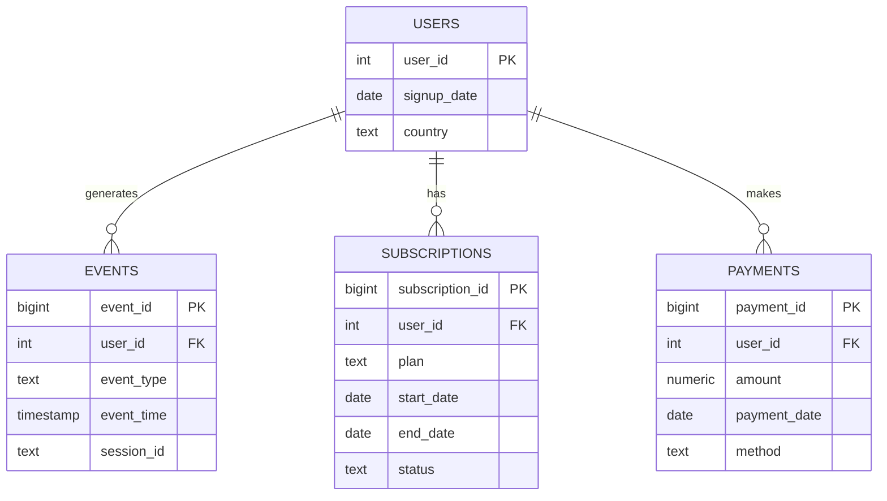

# Product Analytics & Business Insights with SQL 

You are a data scientist supporting a product team (SaaS / e-commerce style).
Stakeholders ask:
- **Where are users dropping off?**
- **Which customers are most valuable (LTV)?**
- **Which features drive retention?**
- **Which plans churn more?**

This repo provides a complete SQL project:
✅ schema + synthetic dataset  
✅ advanced analytics queries (CTEs, windows, time analysis, funnels, cohorts)  
✅ a place to write product insights (not just SQL)

---

## Repo Structure
```
sql-product-analytics/
├── schema.sql
├── data.sql
├── queries/
│   ├── funnel_analysis.sql
│   ├── retention_cohorts.sql
│   ├── revenue_metrics.sql
│   └── window_functions.sql
├── README.md
└── insights.md
```

---

## ER Diagram (Logical)



---

## Setup (PostgreSQL)

1) Create a database (example):
```sql
CREATE DATABASE product_analytics;
```

2) Load schema + data:
```bash
psql -d product_analytics -f schema.sql
psql -d product_analytics -f data.sql
```

3) Run queries:
```bash
psql -d product_analytics -f queries/funnel_analysis.sql
```

> Tip: If you prefer a GUI, open the database in DBeaver or DataGrip and run each file.

---


